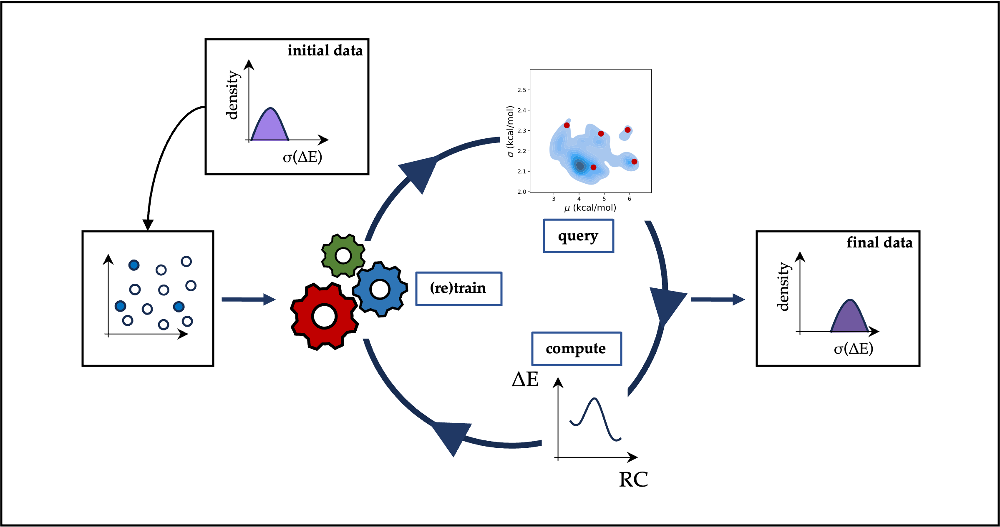

[](https://github.com/chimie-paristech-CTM/ML_DFT_benchmarking/master/LICENSE)

# Improving the reliability of, and confidence in, DFT functional benchmarking through active learning
This repository contains the code and auxiliary data associated with the "Improving the reliability of, and confidence 
in, DFT functional benchmarking through active learning" project. Code is provided "as-is". Minor edits may be required 
to tailor the scripts for different computational systems.



### Conda environment
To set up the conda environment:
```
conda env create --name <env-name> --file environment.yml
```

### Requirements
In order to execute the autodE high-throughput reaction profile computation workflow, Gaussian09/Gaussian16 and xTB 
needs to be accessible.

## Curating the dataset
The scripts used for transforming the xyz-coordinates in reaction SMILES is `scripts/analyze_data.py`. Execution as 
follows:

```
python scripts/analyze_data.py --raw_data data/raw_data --iter initial --generate_initial_data
```

The `xyz` files should be in the directory `data/XYZ_files`. A `data_smiles.csv` file will be generated in the `data`
directory. The script only works with neutral molecules, for the case of charged molecules, an error will be displayed, 
and you should add manually the reaction SMILES. The final version of the initial training set can be found in
`data/data_smiles_curated.csv`

## Generating the chemical space
The script used for generating the chemical space is `script/generate_space.py`. Execution as follows:

```
python scripts/generate_space.py --template_cores data/hypothetical_space_core.csv
```

A `hypothetical_chemical_space.csv` file will be generated in the `data` directory. 

## Baseline ML models
The script used for running the baseline models is `script/baseline_models.py`. The `baseline_model.py` script, 
which runs each of the baseline models sequentially, can be executed as follows:

````
python baseline_models.py --csv-file data/data_smiles_curated.csv 
````

The fingerprints are generated during runtime. The [DRFP](https://doi.org/10.1039/D1DD00006C) and 
[Morgan](https://doi.org/10.1021/ci100050t) fingerprint is used. A nested cross-validation is implemented. For a final
evaluation of the model you should use the option `--final_cv`

An example of the input file is included in the `data` directory: `data_smiles_curated.csv`. 

## Bayesian optimization campaign

Each iteration of the bayesian optimization campaign is launched with the help of the `final_model.py` script. Execution as follows: 

````
final_model.py [-h] [--train_file TRAIN_FILE] [--pool_file POOL_FILE] [--new_data_file NEW_DATA_FILE] [--iteration ITERATION] [--seed SEED] [--beta BETA]
                      [--final_dir FINAL_DIR] [--cutoff CUTOFF] [--conda_env CONDA_ENV] [--new_data NEW_DATA] [--selective_sampling SELECTIVE_SAMPLING]
                      [--selective_sampling_data SELECTIVE_SAMPLING_DATA]
````


## Reproducibility

To reproduce the acquired reaction each round as well the mean absolute error of each set and the plots, a bash script is provided. 
Execution as follows:

````
bash reproducibility.sh
````

An example of the autodE input can be found in `data/autode_input_8`. 

## References

If (parts of) this workflow are used as part of a publication please cite the associated paper:
```
@article{ml_functional,
  author = {Alfonso-Ramos, Javier E. and Adamo, Carlo and Br{\'e}mond, {\'E}ric and Stuyver, Thijs},
  title = {Improving the Reliability of, and Confidence in, {DFT} Functional Benchmarking through Active Learning},
  journal = {J. Chem. Theory Comput.},
  volume = {21},
  number = {4},
  pages = {1752-1761},
  year = {2025},
  doi = {10.1021/acs.jctc.4c01729},
}
```
